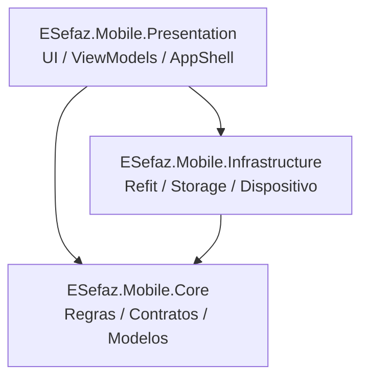

# 📱 e-SEFAZ Mobile (App Auditor) — Arquitetura e Guia de Estudos

> [!NOTE]
> Esta nota foi gerada para consolidação de estudos do aplicativo móvel oficial da **Secretaria de Fazenda do Estado do Rio Grande do Norte (SEFAZ/RN)**, voltado para os auditores fiscais em operações de trânsito e postos de fronteira.

---

## 🏛️ 1. Visão Geral da Arquitetura

O projeto foi desenvolvido sobre a plataforma **.NET MAUI (Multi-platform App UI)** com C# (.NET 8/9), visando os sistemas operacionais **Android** e **iOS**.

### Transição Arquitetural
A solução passou por uma modernização estrutural:
* **Legado:** Múltiplos projetos com separação complexa baseada em CQRS e MediatR (`Application`, `Domain`, `ClientApi`, `Infra`), gerando camadas intermediárias e ViewModels com responsabilidades misturadas.
* **Nova Arquitetura (Simplificada):** Uma variante enxuta de **Clean Architecture** combinada com **MVVM (Model-View-ViewModel)** e injeção de dependência nativa do .NET (`Microsoft.Extensions.DependencyInjection`), dividida em **3 projetos principais**:

```
ESefaz.Mobile/
├── Src/
│   ├── ESefaz.Mobile.Core             (Domínio, Contratos, DTOs e Lógica de Negócio)
│   ├── ESefaz.Mobile.Infrastructure   (Refit HTTP Clients, APIs, Storage, Plataforma)
│   └── ESefaz.Mobile.Presentation     (UI MAUI em C#, ViewModels MVVM, Shell, Startup)
```



---

## 📦 2. Responsabilidade das Camadas

### 1. `ESefaz.Mobile.Core` (Núcleo da Aplicação)
* **Princípio:** Não depende de nenhuma outra camada do projeto, nem de bibliotecas de UI ou clientes HTTP específicos.
* **Conteúdo:**
  * **Contratos:** Interfaces de serviços (`ILoginService`, `IAuthenticationService`, `IConsultaContribuinteService`).
  * **Modelos e DTOs:** Classes de transferência de dados (`LoginDto`, `LoginCommand`).
  * **Requests / Responses:** Modelos de serialização JSON esperados pelas APIs REST da SEFAZ.
  * **Validações e Constantes:** Regras de validação (ex: CPF/CNPJ) e enumerações de domínio.

### 2. `ESefaz.Mobile.Infrastructure` (Integrações e Infraestrutura)
* **Princípio:** Implementa os contratos definidos no `Core`.
* **Conteúdo:**
  * **Clientes REST:** Utiliza a biblioteca **Refit** (`IAuthApiClient`, `ICadastrosApiClient`), gerando chamadas HTTP tipadas.
  * **Pipeline de Rede:** Interceptadores HTTP (`DelegatingHandler`) para injeção automática de token Bearer (`RefitAuthorizationHandler`), logs e retentativas em caso de sessão expirada.
  * **Persistência Local:** Armazenamento seguro de sessão e credenciais via `Microsoft.Maui.Storage.Preferences` e `UserSessionStorage`.
  * **Serviços de Plataforma:** Identificador único de hardware no Android/iOS (`IDeviceIdentifierProvider`) e biometria/FaceID (`BiometricAuthService`).

### 3. `ESefaz.Mobile.Presentation` (Interface do Usuário e Inicialização)
* **Princípio:** Camada visual e ponto de entrada da aplicação.
* **Conteúdo:**
  * **Inicialização:** [MauiProgram.cs](file:///c:/desenvolvimento/e-sefaz-mobile/ESefaz.Mobile/Src/ESefaz.Mobile.Presentation/MauiProgram.cs), configurando handlers, fontes e injeção de dependências.
  * **C# UI / Code-Behind:** Diferente do padrão tradicional puramente em XAML, grande parte das páginas (`Pages/*.cs`) é implementada diretamente em C#, criando os componentes via código e vinculando por *Data Binding*.
  * **Padrão MVVM:** Suporte ao `CommunityToolkit.Mvvm`, com ViewModels herdando de `ObservableObject` / `AbstractObservableBase` e utilizando anotações como `[ObservableProperty]` e `[RelayCommand]`.

---

## 🗂️ 3. Módulos Funcionais do Aplicativo

| #      | Módulo                                      | Descrição Funcional                                                                                         | Principais Arquivos                                                                   |
| ------ | ------------------------------------------- | ----------------------------------------------------------------------------------------------------------- | ------------------------------------------------------------------------------------- |
| **1**  | **Acesso, Autenticação e Sessão**           | Login (CPF/senha), SSO, Biometria/FaceID, registro de dispositivo, renovação de token e controle de sessão. | `LoginPage`, `LoginViewModel`, `AuthenticationService`, `IAuthApiClient`              |
| **2**  | **Home, Navegação e Perfil**                | `AppShell`, tela inicial com atalhos dinâmicos, favoritos, menu funcional e vínculo de empresa.             | `HomePage`, `HomeViewModel`, `AppMenuPage`, `VincularEmpresaPage`                     |
| **3**  | **Consulta de Contribuinte**                | Busca cadastral de pessoa física e jurídica por CPF/CNPJ/IE, validação e exibição detalhada.                | `ConsultaContribuintePage`, `ResultadosConsultaPage`, `ConsultaContribuinteService`   |
| **4**  | **Documentos Fiscais Eletrônicos (DF-e)**   | Consulta de NF-e e NFC-e, leitura de QR Code, scanner de código de barras e visualização de DANFE.          | `ConsultaDocumentosPage`, `QRCodePage`, `DocumentScannerPage`, `DanfePage`            |
| **5**  | **MDF-e (Manifesto Eletrônico)**            | Consulta de MDF-e por chave/filtros, listagem por status (Autorizado, Cancelado, Encerrado) e detalhes.     | `ConsultaMdfePage`, `ListaMdfePage`, `InformacoesMdfePage`                            |
| **6**  | **Consulta por Placa de Veículo**           | Fiscalização de veículos em trânsito com carregamento de NF-es, MDF-es vinculados e termos fiscais.         | `ConsultaPlacasPage`, `ConsultaPlacasViewModel`, `NFePlacaService`                    |
| **7**  | **Fiscalização - TRM (Termo de Apreensão)** | Consulta e listagem de TRMs, detalhamento de mercadorias apreendidas e visualizador de PDF.                 | `ListaTamPage`, `DetalheListaTamPage`, `VisualizadorPdfPage`                          |
| **8**  | **Procedimentos TRM**                       | Gestão operacional de apreensões: registro de ciência, recusa, fiel depositário e cancelamento.             | `DetalhesProcedimentoTamPage`, `NomearFielDepositarioPage`, `RegistroCienciaPage`     |
| **9**  | **Lavratura de TAM (Wizard)**               | Fluxo em etapas guiadas (Identificação, Momento, Ocorrências, Débitos, Rascunhos) para autuação.            | `LavraturaTAMWizardPage`, `TermoApreensaoMercadoriaPage`, `GerarDebitoTAMPage`        |
| **10** | **Arrecadação Vinculada**                   | Emissão de GRI (Guia de Recolhimento) e boletos atrelados a termos de apreensão.                            | `EmitirGriTamPage`, `EmitirGriTamDetDebitosPopup`                                     |
| **11** | **Liberação de Mercadorias (Fronteira)**    | Consulta de mercadoria retida por chave NFe, conferência em posto fiscal e inclusão de justificativa.       | `LiberacaoMercadoriaPage`, `DetalheLiberacaoMercadoriaPage`, `JustificativaPopupPage` |
| **12** | **Parte de Serviço (PS)**                   | Registro e acompanhamento de Ordens/Partes de Serviço dos auditores fiscais com download de anexos.         | `ParteServicoPage`, `ParteServicoViewModel`                                           |
| **13** | **SMART e Lotes**                           | Inclusão de lotes de notas fiscais e análise automatizada em lote.                                          | `IncluirLotePage`, `AnalisarLotePage`                                                 |
| **14** | **Argos Chatbot**                           | Assistente virtual integrado para suporte e dúvidas operacionais do auditor fiscal.                         | `ArgosChatPage`, `ArgosChatViewModel`, `ArgosChatbotService`                          |
| **15** | **Infraestrutura Transversal**              | Tratamento global de erros, loading padronizado, notificações locais/push e feedback háptico.               | `GlobalExceptionHandler`, `ApiLoadingService`, `HapticFeedbackService`                |

---

## 🎯 4. Módulo Indicado para Estudos: Autenticação (`Auth`)

### Por que este módulo é a melhor referência?
1. **É a fundação do aplicativo:** todo o ciclo de vida depende da autenticação e do registro do dispositivo.
2. **Padrão ouro de refatoração:** contém tanto a versão original de produção quanto a versão refatorada moderna (`LoginViewModelRefactored.cs`), ilustrando claramente a simplificação de responsabilidades que o time está buscando.
3. **Fluxo completo ponta a ponta:** cobre todas as camadas do sistema.

### Mapa Mental do Fluxo de Autenticação:
```
[LoginPage] (View C#)
      │ Data Binding
      ▼
[LoginViewModel / LoginViewModelRefactored] (Presentation)
      │ Injeção de Dependência
      ▼
[IAuthenticationService / ILoginService] (Core Contracts)
      │ Implementação
      ▼
[AuthenticationService / LoginService] (Infrastructure)
      │ Refit Client
      ▼
[IAuthApiClient] ──(HTTP POST /api/Auth)──► Backend SEFAZ
      │
      ▼
[UserSessionStorage] (Persiste token & sessão no Preferences local)
```

---

## 📖 5. Roteiro de Estudo Arquivo por Arquivo

Siga a ordem recomendada abaixo para compreender o fluxo dos dados:

### Etapa 1: Contratos e Modelos no `Core`
1. **[ILoginService.cs](file:///c:/desenvolvimento/e-sefaz-mobile/ESefaz.Mobile/Src/ESefaz.Mobile.Core/Services/ILoginService.cs)**
   - *O que observar:* O contrato que define o método `SignInAsync(LoginCommand command)`. É conciso e desacoplado de detalhes tecnológicos.
2. **[IAuthenticationService.cs](file:///c:/desenvolvimento/e-sefaz-mobile/ESefaz.Mobile/Src/ESefaz.Mobile.Core/Services/Auth/IAuthenticationService.cs)**
   - *O que observar:* A interface moderna que orquestra o ciclo completo (login, logout, biometria e verificação de sessão).
3. **[LoginCommand.cs](file:///c:/desenvolvimento/e-sefaz-mobile/ESefaz.Mobile/Src/ESefaz.Mobile.Core/Commands/User/Login/LoginCommand.cs)**
   - *O que observar:* Classe simples de comando que transporta as credenciais informadas pelo usuário (`Login` e `Password`).
4. **[LoginDto.cs](file:///c:/desenvolvimento/e-sefaz-mobile/ESefaz.Mobile/Src/ESefaz.Mobile.Core/Dtos/User/LoginDto.cs)**
   - *O que observar:* O objeto de transferência com o resultado da autenticação (Token JWT).
5. **[LoginRequest.cs](file:///c:/desenvolvimento/e-sefaz-mobile/ESefaz.Mobile/Src/ESefaz.Mobile.Core/Requests/Auth/LoginRequest.cs)** e **[LoginResponse.cs](file:///c:/desenvolvimento/e-sefaz-mobile/ESefaz.Mobile/Src/ESefaz.Mobile.Core/Responses/Auth/LoginResponse.cs)**
   - *O que observar:* Os contratos de serialização JSON com anotações `[JsonProperty]` direcionados à API REST.

### Etapa 2: Implementação e Comunicação na `Infrastructure`

6. **[IAuthApiClient.cs](file:///c:/desenvolvimento/e-sefaz-mobile/ESefaz.Mobile/Src/ESefaz.Mobile.Infrastructure/Api/Auth/IAuthApiClient.cs)**
   - *O que observar:* A declaração da interface usando a biblioteca **Refit**:
     ```csharp
     [Post("/api/Auth")]
     Task<LoginResponse> SigInAsync([Body] LoginRequest request);
     ```

6. **[LoginService.cs](file:///c:/desenvolvimento/e-sefaz-mobile/ESefaz.Mobile/Src/ESefaz.Mobile.Infrastructure/Services/LoginService.cs)**
   - *O que observar:* Como o serviço recebe `IAuthApiClient` e `IMapper` via injeção por construtor, mapeia o comando para o request e despacha a requisição.
8. **[AuthenticationService.cs](file:///c:/desenvolvimento/e-sefaz-mobile/ESefaz.Mobile/Src/ESefaz.Mobile.Infrastructure/Auth/AuthenticationService.cs)**
   - *O que observar:* A camada intermediária que trata autenticação biométrica, gravação segura de dados e validações adicionais.
9. **[UserSessionStorage.cs](file:///c:/desenvolvimento/e-sefaz-mobile/ESefaz.Mobile/Src/ESefaz.Mobile.Infrastructure/Storage/UserSessionStorage.cs)**
   - *O que observar:* Métodos `SaveSessionAsync`, `GetSessionAsync` e `ClearSessionAsync` gravando em `Microsoft.Maui.Storage.Preferences`.
10. **[SetupClientApi.cs](file:///c:/desenvolvimento/e-sefaz-mobile/ESefaz.Mobile/Src/ESefaz.Mobile.Infrastructure/Api/SetupClientApi.cs)**
    - *O que observar:* Registro do cliente Refit:
      `services.AddRefitClient<IAuthApiClient>()` associando a URL base da SEFAZ e os `DelegatingHandlers`.
11. **[ServiceCollectionExtensions.cs](file:///c:/desenvolvimento/e-sefaz-mobile/ESefaz.Mobile/Src/ESefaz.Mobile.Infrastructure/DependencyInjection/ServiceCollectionExtensions.cs)**
    - *O que observar:* O método `AddAuthenticationServices` onde todos os serviços dessa cadeia são registrados no container de Injeção de Dependências.

### Etapa 3: Apresentação e Interação na `Presentation`
12. **[LoginViewModelRefactored.cs](file:///c:/desenvolvimento/e-sefaz-mobile/ESefaz.Mobile/Src/ESefaz.Mobile.Presentation/ViewModels/Auth/LoginViewModelRefactored.cs)**
    - *O que observar:* Estudo obrigatório! Veja como a lógica de negócio foi delegada para os serviços, deixando o ViewModel com apenas ~150 linhas responsável unicamente pelo estado da UI e navegação.
13. **[LoginViewModel.cs](file:///c:/desenvolvimento/e-sefaz-mobile/ESefaz.Mobile/Src/ESefaz.Mobile.Presentation/ViewModels/LoginViewModel.cs)**
    - *O que observar:* Versão atual em produção com fluxos adicionais (SSO, usuário Apple Review para aprovação na loja, tratamento detalhado de erros).
14. **[LoginPage.cs](file:///c:/desenvolvimento/e-sefaz-mobile/ESefaz.Mobile/Src/ESefaz.Mobile.Presentation/Pages/LoginPage.cs)**
    - *O que observar:* Construção visual em C# (sem XAML). Repare em como os controles fazem binding com o ViewModel:
      ```csharp
      txtCodigoUsuario.SetBinding(Entry.TextProperty, nameof(LoginViewModel.Login));
      ```
15. **[MauiProgram.cs](file:///c:/desenvolvimento/e-sefaz-mobile/ESefaz.Mobile/Src/ESefaz.Mobile.Presentation/MauiProgram.cs)**
    - *O que observar:* O `MauiApp.CreateBuilder()` onde os serviços de infraestrutura e as páginas/ViewModels são vinculados.

---

## 🛠️ 6. Comandos Úteis para Estudo e Compilação

Para compilar e inspecionar cada camada individualmente pelo terminal (na pasta raiz `c:\desenvolvimento\e-sefaz-mobile\ESefaz.Mobile`):

```bash
# Compilar o Core (não depende de MAUI nem de APIs)
dotnet build Src/ESefaz.Mobile.Core/ESefaz.Mobile.Core.csproj

# Compilar a Infraestrutura
dotnet build Src/ESefaz.Mobile.Infrastructure/ESefaz.Mobile.Infrastructure.csproj

# Compilar a Solution completa
dotnet build ESefaz.Mobile.sln
```
