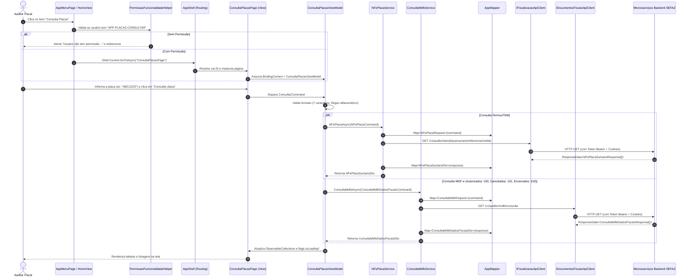

# Consulta de Placas — Arquitetura e Fluxo de Dados

> [!abstract] Objetivo do Documento
> Mapeamento completo e aprofundado do módulo de **Consulta de Placas** do aplicativo **e-SEFAZ Mobile** (.NET MAUI).
> Abrange desde a ativação da rota e checagem de permissões até a interface gráfica, orquestração na ViewModel e persistência/acesso a dados via clientes HTTP Refit.

---

## 1. Visão Geral da Funcionalidade

A funcionalidade **Consulta de Placas** permite que o auditor fiscal consulte o histórico e a situação fiscal vinculada à placa de um veículo (automóvel, caminhão, transporte de carga etc.).

Ao realizar a busca por uma placa válida (formato alfanumérico de 7 caracteres, seja padrão antigo ou Mercosul), a aplicação orquestra chamadas assíncronas paralelas aos serviços de backend da SEFAZ para consolidar:
1. **NF-es / Termos de Apreensão de Mercadoria (TAM/TRM)** vinculados à placa.
2. **MDF-e Autorizados** (`Status = 100`).
3. **MDF-e Cancelados** (`Status = 101`).
4. **MDF-e Encerrados** (`Status = 102`).

O auditor também pode selecionar qualquer Termo retornado para abrir o detalhamento do procedimento fiscal.

---

## 2. Diagrama de Sequência Ponta a Ponta



---

## 3. Camada 1: Roteamento, Permissões e Inicialização (Entry Points)

### 3.1. Registro de Rotas Globais
No Shell da aplicação, a rota de navegação é cadastrada de forma estática para permitir navegação por URI:
* **Arquivo:** `ESefaz.Mobile.Presentation/AppShell.xaml.cs`
```csharp
Routing.RegisterRoute("ConsultaPlacasPage", typeof(ConsultaPlacasPage));
```

### 3.2. Controle de Acesso e Permissão
A funcionalidade é protegida pela constante de segurança `APP PLACAS CONSULTAR`.
* **Arquivo:** `ESefaz.Mobile.Presentation/Helpers/PermissaoFuncionalidadeHelper.cs`
* **Arquivo de Constantes:** `ESefaz.Mobile.Core/Constants/ConstantesPermissoes.cs`

```csharp
public static string? ObterPermissaoPorTituloTela(string? tituloTela)
{
    return tituloTela switch
    {
        // ...
        "Consulta Placas" => ConstantesPermissoes.AppPlacasConsultar,
        // ...
    };
}
```
> [!note] Validação de Sessão
> O helper verifica a lista de permissões armazenada em cache no `Preferences` (objeto de sessão do usuário logado). Se o usuário não possuir a claim necessária, a navegação é abortada e uma mensagem de advertência é exibida.

### 3.3. Pontos de Entrada da UI
Existem dois caminhos principais para o usuário abrir a tela:
1. **Menu Lateral (Drawer):**
   * **Arquivo:** `ESefaz.Mobile.Presentation/Pages/AppMenuPage.cs`
   ```csharp
   AddMenuItemIfPermitted(menuStack, "Consulta Placas", 
       async () => await OpenPageAsync<ConsultaPlacasPage>("Consulta Placas"));
   ```
2. **Atalhos da Tela Inicial (Home / Acesso Rápido):**
   * **Arquivo:** `ESefaz.Mobile.Presentation/ViewModels/HomeViewModel.cs`
   ```csharp
   "Consulta Placas" => services.GetService<ConsultaPlacasPage>()
   ```

### 3.4. Injeção de Dependência (DI)
O container nativo do .NET MAUI é configurado na inicialização:
* **Arquivo:** `ESefaz.Mobile.Presentation/MauiProgram.cs`
```csharp
// Serviços de negócio da Consulta Placa
builder.Services.AddTransient<INFePlacaService, NFePlacaService>();
builder.Services.AddTransient<IConsultaMdfeService, ConsultaMdfeService>();
builder.Services.AddTransient<IConsultarDetalheTermoApreensaoService, ConsultarDetalheTermoApreensaoService>();

// Camada de Apresentação
builder.Services.AddTransient<ConsultaPlacasViewModel>();
builder.Services.AddTransient<ConsultaPlacasPage>();
```

---

## 4. Camada 2: Apresentação (View & ViewModel - MVVM)

### 4.1. A View: `ConsultaPlacasPage.cs`
* **Localização:** `ESefaz.Mobile.Presentation/Pages/ConsultaPlacasPage.cs`
* **Padrão de Construção:** Fluent C# (UI construída em C# sem arquivo `.xaml` associado).
* **Componentes Principais:**
  - `StandardPageHeaderView`: Barra superior com botão voltar vinculado ao `VoltarCommand`.
  - `Entry` (`_placaEntry`): Campo de digitação com binding para `PlacaDigitada`.
  - `LabelErro` / `Border`: Borda dinâmica (`PlacaFrameColor`) e label de erro (`MostrarErroPlaca`, `TextoErroPlaca`).
  - `Button` ("Consultar placa"): Aciona o `ConsultarCommand`.
  - **4 Seções de Dados:**
    1. Termos de Apreensão (NF-e): Vinculado a `NFesList` com skeleton loader (`IsLoadingTermos`) e empty state (`MostrarSemTermo`).
    2. MDF-e Autorizado: Vinculado a `MdfeAutorizadoList` (`IsLoadingMdfeAutorizado`, `MostrarSemAutorizado`).
    3. MDF-e Cancelado: Vinculado a `MdfeCanceladoList` (`IsLoadingMdfeCancelado`, `MostrarSemCancelado`).
    4. MDF-e Encerrado: Vinculado a `MdfeEncerradoList` (`IsLoadingMdfeEncerrado`, `MostrarSemEncerrado`).

### 4.2. A ViewModel: `ConsultaPlacasViewModel.cs`
* **Localização:** `ESefaz.Mobile.Presentation/ViewModels/ConsultaPlacasViewModel.cs`
* Herda de `BaseViewModel` (utiliza geradores de código do `CommunityToolkit.Mvvm`).
* **Propriedades Observáveis:**
  - `PlacaDigitada`: Sanitizada automaticamente para letras maiúsculas via `partial void OnPlacaDigitadaChanged(string value)`.
  - `NFesList`, `MdfeAutorizadoList`, `MdfeCanceladoList`, `MdfeEncerradoList`: Coleções observáveis atualizadas após as requisições.
  - Flags booleanas de carregamento (`IsLoadingTermos`, `IsLoadingMdfeAutorizado`, etc.) para controlar animações de skeleton na View.

#### Regras de Validação:
```csharp
private bool ValidarPlacaAntesDaConsulta()
{
    if (string.IsNullOrWhiteSpace(PlacaDigitada))
    {
        ExibirErroPlaca("Preencha este campo");
        return false;
    }

    if (PlacaDigitada.Length != 7)
    {
        ExibirErroPlaca("A placa deve conter 7 caracteres.");
        return false;
    }

    if (PlacaRegex.IsMatch(PlacaDigitada)) // Regex [^a-zA-Z0-9]
    {
        ExibirErroPlaca("A placa deve conter apenas letras e números.");
        return false;
    }

    return true;
}
```

#### Disparo Assíncrono Paralelo:
```csharp
[RelayCommand]
private async Task ConsultarAsync()
{
    await ExecuteAsync(async () =>
    {
        if (!ValidarPlacaAntesDaConsulta()) return;

        NFesList.Clear();
        MdfeAutorizadoList.Clear();
        MdfeCanceladoList.Clear();
        MdfeEncerradoList.Clear();

        var nfeTask = CarregarTermosAsync();
        var autorizadoTask = CarregarMdfeAsync(100, MdfeAutorizadoList, nameof(IsLoadingMdfeAutorizado));
        var canceladoTask = CarregarMdfeAsync(101, MdfeCanceladoList, nameof(IsLoadingMdfeCancelado));
        var encerradoTask = CarregarMdfeAsync(102, MdfeEncerradoList, nameof(IsLoadingMdfeEncerrado));

        await Task.WhenAll(nfeTask, autorizadoTask, canceladoTask, encerradoTask);
    }, showGlobalError: false);
}
```

#### Aprofundamento no Detalhe do Termo:
Ao tocar em um item da lista de termos, o comando `AbrirPopupDetalheTermoApreensaoCommand` executa `IConsultarDetalheTermoApreensaoService.ConsultarDetalheTermoApreensaoAsync(...)` e redireciona para `DetalhesProcedimentoTamPage` passando o parâmetro de navegação estruturado.

---

## 5. Camada 3: Aplicação e Domínio (Core)

Esta camada concentra os contratos, DTOs e entidades de domínio, garantindo independência de bibliotecas de terceiros ou frameworks visuais.

### 5.1. Interfaces de Serviço
* **`INFePlacaService.cs`** (`ESefaz.Mobile.Core/Services/INFePlacaService.cs`):
  ```csharp
  public interface INFePlacaService
  {
      Task<NFePlacaSumarioDto> NFePlacaAsync(NFePlacaCommand command);
  }
  ```
* **`IConsultaMdfeService.cs`** (`ESefaz.Mobile.Core/Services/IConsultaMdfeService.cs`):
  ```csharp
  public interface IConsultaMdfeService
  {
      Task<ConsultaMdfeDadosFiscaisDto> ConsultaMdfeAsync(ConsultaMdfeDadosFiscaisCommand command);
  }
  ```
* **`IConsultarDetalheTermoApreensaoService.cs`** (`ESefaz.Mobile.Core/Services/IConsultarDetalheTermoApreensaoService.cs`):
  ```csharp
  public interface IConsultarDetalheTermoApreensaoService
  {
      Task<TamPlacaDto> ConsultarDetalheTermoApreensaoAsync(TamPlacaCommand command);
  }
  ```

### 5.2. Commands e DTOs
* **`NFePlacaCommand`** (`ESefaz.Mobile.Core/Commands/Fiscalizacao/Tam/NFePlacaCommand.cs`):
  Carrega a propriedade `Placa`.
* **`ConsultaMdfeDadosFiscaisCommand`** (`ESefaz.Mobile.Core/Commands/DocumentosFiscais/ConsultaPlaca/ConsultaMdfeDadosFiscaisCommand.cs`):
  Carrega `Placa`, `StatusMDFe`, `TipoOperacao = "T"`, e datas de emissão (`DtMDFeEmissaoInicial`, `DtMDFeEmissaoFinal`).
* **`NFePlacaSumarioDto`** (`ESefaz.Mobile.Core/Dtos/Fiscalizacao/NFePlacaSumarioDto.cs`):
  Contém array de `NFePlacaSumario` (`QtdTam`, `TotalIcms`, `TotalMulta`, `TotalFecop`, `TotalTam`, `Ano`).
* **`ConsultaMdfeDadosFiscaisDto`** (`ESefaz.Mobile.Core/Dtos/DocumentosFiscais/ConsultaMdfeDadosFiscaisDto.cs`):
  Contém array de `ConsultaMdfeDadosFiscais` (`Chave`, `MdfeSerie`, `DataEmissao`, `UfInicio`, `UfFim`, `Status`, `ValorCarga` etc.).

---

## 6. Camada 4: Infraestrutura e Acesso a Dados (Infrastructure)

Implementa o acesso aos dados externos via microsserviços HTTP REST.

### 6.1. Implementação dos Serviços
* **`NFePlacaService.cs`** (`ESefaz.Mobile.Infrastructure/Services/NFePlacaService.cs`):
  ```csharp
  public class NFePlacaService : INFePlacaService
  {
      private readonly IFiscalizacaoApiClient _fiscalizacaoApiClient;
      private readonly IMapper _mapper;

      public async Task<NFePlacaSumarioDto> NFePlacaAsync(NFePlacaCommand command)
      {
          var request = _mapper.Map<NFePlacaRequest>(command);
          var response = await _fiscalizacaoApiClient.ConsultaNfesPorPlacaAsync(request);
          return _mapper.Map<NFePlacaSumarioDto>(response.GetResultOrThrow(nameof(NFePlacaAsync)));
      }
  }
  ```
* **`ConsultaMdfeService.cs`** (`ESefaz.Mobile.Infrastructure/Services/ConsultaMdfeService.cs`):
  ```csharp
  public class ConsultaMdfeService : IConsultaMdfeService
  {
      private readonly IDocumentosFiscaisApiClient _consultaMdfeApiClient;
      private readonly IMapper _mapper;

      public async Task<ConsultaMdfeDadosFiscaisDto> ConsultaMdfeAsync(ConsultaMdfeDadosFiscaisCommand command)
      {
          var request = _mapper.Map<ConsultaMdfeRequest>(command);
          var response = await _consultaMdfeApiClient.ConsultaMDFeAsync(request);
          if (response?.Result == null)
              throw new InvalidOperationException("Nenhum resultado encontrado.");

          return _mapper.Map<ConsultaMdfeDadosFiscaisDto>(response.Result);
      }
  }
  ```

### 6.2. Mapeamento de Objetos (`AppMapper.cs`)
* **Localização:** `ESefaz.Mobile.Infrastructure/Mappings/AppMapper.cs`
* Converte comandos em requests e responses em DTOs.
* No caso do MDF-e, formata datas com segurança:
  ```csharp
  private static ConsultaMdfeRequest MapConsultaMdfeRequest(ConsultaMdfeDadosFiscaisCommand source)
  {
      return new ConsultaMdfeRequest
      {
          Placa = source.Placa,
          StatusMDFe = source.StatusMDFe,
          TipoOperacao = source.TipoOperacao,
          DtMDFeEmissaoInicial = source.DtMDFeEmissaoInicial?.ToString("yyyy-MM-dd", CultureInfo.InvariantCulture),
          DtMDFeEmissaoFinal = source.DtMDFeEmissaoFinal?.ToString("yyyy-MM-dd", CultureInfo.InvariantCulture),
          // ...
      };
  }
  ```

### 6.3. Clientes Refit (Definição dos Endpoints HTTP)
Os clientes usam **Refit** para tipar as chamadas REST:

1. **`IFiscalizacaoApiClient.cs`** (`ESefaz.Mobile.Infrastructure/Api/Fiscalizacao/IFiscalizacaoApiClient.cs`):
   ```csharp
   [Get("/v1/auditor/tam/placa/sumario/referencia/mobile")]
   Task<ApiResponse<ResponseData<NFePlacaSumarioResponse[]>>> ConsultaNfesPorPlacaAsync([Query] NFePlacaRequest request);

   [Get("/v1/auditor/tam/placa/detalhamento/referencia/mobile")]
   Task<ApiResponse<ResponseData<TamPlacaResponse[]>>> TamDetalharPorReferenciaAsync([Query] TamPlacaRequest request);
   ```

2. **`IDocumentosFiscaisApiClient.cs`** (`ESefaz.Mobile.Infrastructure/Api/DocumentosFiscais/IDocumentosFiscaisApiClient.cs`):
   ```csharp
   [Get("/v1/auditor/mdfe/consulta")]
   Task<ResponseData<ConsultaMdfeDadosFiscaisResponse[]>> ConsultaMDFeAsync([Query] ConsultaMdfeRequest request);
   ```

### 6.4. Pipeline de Rede, Segurança e Resiliência (`SetupClientApi.cs`)
* **Localização:** `ESefaz.Mobile.Infrastructure/Api/SetupClientApi.cs`
As chamadas HTTP passam por um pipeline composto de handlers encadeados:
```
[Requisição Refit]
       ↓
[RefitUnauthorizedRedirectHandler]  → Detecta HTTP 401 e redireciona para login
       ↓
[RefitSessionRetryHandler]         → Tenta renovar a sessão se expirada
       ↓
[Polly Business Retry Policy]       → Retentativa com backoff exponencial para falhas transitórias
       ↓
[RefitAuthorizationHandler]        → Injeta Token Bearer e Cookies de sessão
       ↓
[RefitLoggingHandler]              → Log de requisição/resposta para diagnóstico
       ↓
[Primary HttpMessageHandler]       → Socket/Handler de rede nativo com CookieContainer
```

---

## 7. Rastreabilidade Rápida de Arquivos

| Camada | Arquivo | Responsabilidade |
| :--- | :--- | :--- |
| **Rota** | `AppShell.xaml.cs` | Registro da rota `"ConsultaPlacasPage"` |
| **Segurança** | `PermissaoFuncionalidadeHelper.cs` | Validação de `APP PLACAS CONSULTAR` |
| **Menu** | `AppMenuPage.cs` / `HomeViewModel.cs` | Navegação a partir do menu e da tela inicial |
| **DI** | `MauiProgram.cs` | Registro no ServiceCollection |
| **View** | `ConsultaPlacasPage.cs` | Interface em Fluent C# com inputs, cards e skeletons |
| **ViewModel** | `ConsultaPlacasViewModel.cs` | Sanitização, validações e orquestração assíncrona paralela |
| **Core (Contratos)** | `INFePlacaService.cs` / `IConsultaMdfeService.cs` | Interfaces de abstração dos serviços |
| **Core (Commands)** | `NFePlacaCommand.cs` / `ConsultaMdfeDadosFiscaisCommand.cs` | Parâmetros de entrada da consulta |
| **Core (DTOs)** | `NFePlacaSumarioDto.cs` / `ConsultaMdfeDadosFiscaisDto.cs` | Dados retornados para apresentação |
| **Infra (Services)** | `NFePlacaService.cs` / `ConsultaMdfeService.cs` | Implementação que orquestra mapeamento e chamada Refit |
| **Infra (Mapper)** | `AppMapper.cs` | Conversor Command ⇄ Request ⇄ Response ⇄ DTO |
| **Infra (Refit)** | `IFiscalizacaoApiClient.cs` / `IDocumentosFiscaisApiClient.cs` | Definição das rotas REST de backend |
| **Infra (Rede)** | `SetupClientApi.cs` | Middlewares HTTP de autenticação, retry Polly e logging |

---

## 8. Dicas para Estudos e Pontos de Observação

1. **Paralelismo com `Task.WhenAll`:**
   Observe na ViewModel como 4 consultas (`NFesList`, `MdfeAutorizadoList`, `MdfeCanceladoList` e `MdfeEncerradoList`) rodam simultaneamente. Isso evita travar a interface e diminui o tempo total de carregamento para o auditor no campo.
2. **Atualização Dinâmica de Estados Vazios:**
   Note que na ViewModel o evento `CollectionChanged` de cada `ObservableCollection` notifica propriedades computadas (`MostrarSemAutorizado`, `MostrarSemCancelado`, etc.), fazendo com que a View alterne dinamicamente entre skeleton, lista e empty state.
3. **Padrão de Resiliência HTTP:**
   Ao estudar chamadas em redes móveis sujeitas a instabilidade, analise como o `AddBusinessApiRetryPolicy` no `SetupClientApi.cs` trabalha em conjunto com o `RefitAuthorizationHandler` para manter a conexão confiável e segura.
