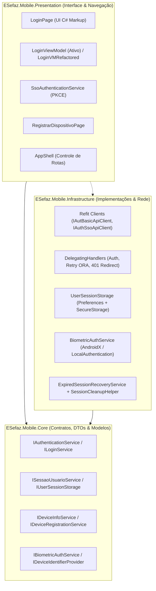
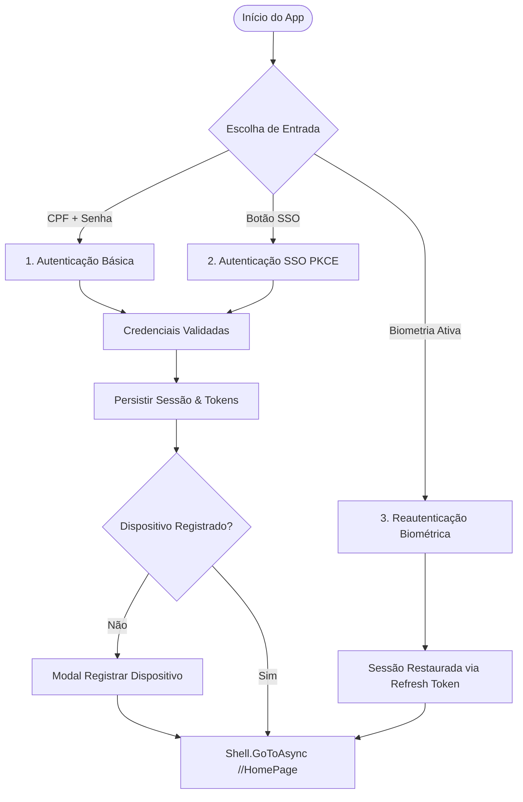
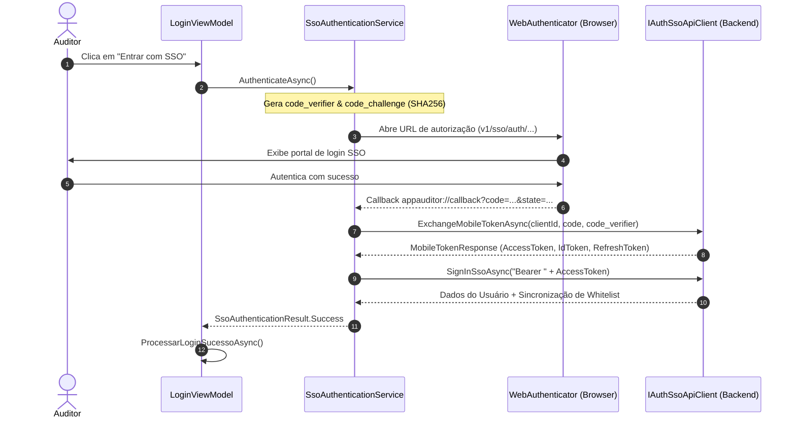
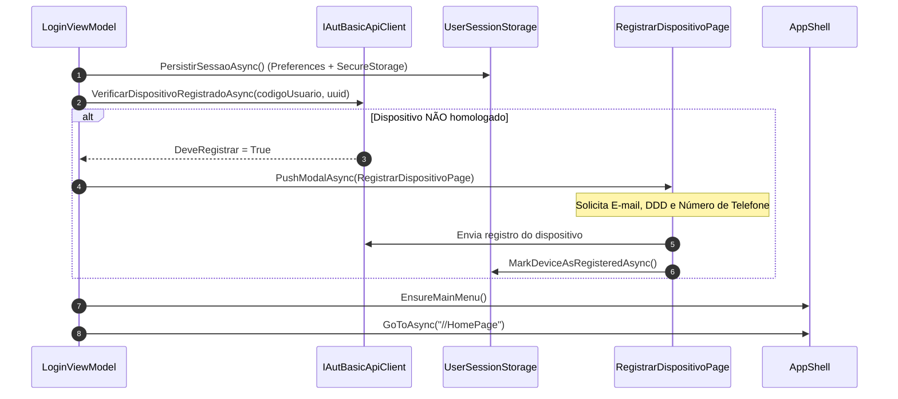
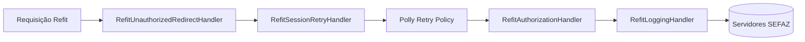

# 🔐 Módulo de Acesso, Autenticação e Sessão — e-SEFAZ Mobile

> [!NOTE]
> Esta nota detalha o fluxo de arquivos, ciclo de vida de tokens, autenticação híbrida (Básica, SSO e Biometria) e a arquitetura de persistência e segurança de sessão do aplicativo **e-SEFAZ Mobile (App Auditor)**.

---

## 🏛️ 1. Visão Geral da Arquitetura do Módulo

O módulo é distribuído entre os 3 projetos da solução sob uma arquitetura limpa adaptada para .NET MAUI:

### Divisão de Responsabilidades

| Camada             | Papel no Módulo                                                                                                                                 | Principais Componentes                                                                                                                                     |
| ------------------ | ----------------------------------------------------------------------------------------------------------------------------------------------- | ---------------------------------------------------------------------------------------------------------------------------------------------------------- |
| **Core**           | Contratos de interface, modelos de request/response e abstrações de plataforma sem acoplamento externo.                                         | `IAuthenticationService`, `IUserSessionStorage`, `ISessaoUsuarioService`, `IDeviceInfoService`, `IDeviceRegistrationService`, `IBiometricAuthService`.     |
| **Infrastructure** | Implementação concreta de chamadas HTTP (Refit), ciclo de interceptores de rede, biometria nativa, armazenamento local e recuperação de sessão. | `AutBasicService`, `UserSessionStorage`, `RefitAuthorizationHandler`, `RefitSessionRetryHandler`, `ExpiredSessionRecoveryService`, `BiometricAuthService`. |
| **Presentation**   | Telas em C# Markup, ViewModels baseados em `CommunityToolkit.Mvvm`, gerenciador de navegação e autenticação SSO com navegador do sistema.       | `LoginPage`, `LoginViewModel`, `SsoAuthenticationService`, `RegistrarDispositivoPage`, `AppShell`.                                                         |

---

## 🔑 2. Mecanismos de Autenticação

O sistema oferece **três modalidades principais de acesso**, além de um fluxo dedicado para homologação.

---

### A. Autenticação Básica (CPF e Senha)

* **Tela de Entrada:** `LoginPage.cs` vinculada a `LoginViewModel.cs`.
* **Comando:** `LoginCommand` (`LoginAsync`).

#### Passo a Passo:
1. O usuário insere CPF e Senha na `LoginPage`.
2. O `DeviceInfoService` consulta o provedor nativo (`AndroidDeviceIdentifierProvider` ou `IosDeviceIdentifierProvider`) e recupera o UUID exclusivo do hardware, versão do SO, modelo e marca.
3. As credenciais são codificadas no formato `Basic <base64(cpf:senha)>`.
4. É executada a chamada `GET /v1/app-auditor/mobile/basic` via `IAutBasicApiClient.SignInRawAsync`.
5. A API retorna `AutBasicResponse` com o objeto `User` (dados do auditor, matrícula, permissões, empresas vinculadas) e `Token` (IdToken, RefreshToken, ExpiresIn).
6. Os dados são persistidos localmente e o fluxo avança para a verificação do dispositivo.

---

### B. Autenticação SSO (Single Sign-On com PKCE)

Para ambientes integrados com o provedor de identidade central da SEFAZ:

* **Orquestrador:** `SsoAuthenticationService.cs`
* **API Client:** `IAuthSsoApiClient.cs`
* **Callback Scheme:** `appauditor://callback`

---

### C. Autenticação Biométrica

* **Serviço Nativo:** `BiometricAuthService.cs`
* **Plataformas:**
  * **Android:** `AndroidX.Biometric.BiometricPrompt` com validação `BiometricStrong` e `BiometricWeak`.
  * **iOS:** `LocalAuthentication.LAContext` avaliando `LAPolicy.DeviceOwnerAuthenticationWithBiometrics`.
* **Fluxo de Sessão:**
  * Ao habilitar a biometria, o **Refresh Token** é armazenado com chave protegida em hardware via `SecureStorage.SetAsync("RefreshToken_{userId}", ...)`.
  * Ao abrir o app, se houver usuário anterior salvo com biometria habilitada, o app apresenta o prompt biométrico nativo.
  * Com o sucesso biométrico, o token é atualizado via refresh sem a necessidade de re-digitar a senha.

---

### D. Apple Review Bypass

No `LoginViewModel.cs`, existe o método `TryProcessAppleReviewLoginAsync()`:
* Quando executado no iOS sob credenciais de teste específicas da revisão (`05503681401`), o app cria uma sessão simulada válida por 30 dias com dados mockados de auditor fiscal, garantindo a aprovação nas diretrizes da App Store sem depender da rede interna da SEFAZ.

---

## 📱 3. Fluxo Pós-Login e Registro de Dispositivo

O e-SEFAZ Mobile exige que o dispositivo físico do auditor seja homologado na base:

---

## 🌐 4. Gestão de Sessão e Pipeline HTTP (Refit Interceptors)

Todas as requisições para os microsserviços da SEFAZ (Documentos Fiscais, Lavratura TAM, Arrecadação, Cadastro) passam por um pipeline configurado em `SetupClientApi.cs`:

### Detalhamento dos Handlers:

#### 1. `RefitAuthorizationHandler` (Injetor de Contexto e Tokens)
* **Cabeçalhos Comuns:** Injeta automaticamente `client_id: b850e9e3`.
* **Contexto de Empresa:** Lê a empresa selecionada em `ISessaoUsuarioService.EmpresaSelecionada` e injeta os headers `cnpj` e `ie` da empresa ativa (fundamental para operações de auditoria em empresas específicas).
* **Resolução Dinâmica do Bearer Token:**
  1. Verifica se a rota já possui token explícito.
  2. Prioridade 1: Sessão unificada de `IUserSessionStorage`. Se a rota for de SSO (`/v1/sso/`, `/appauditor/`), usa o `AccessToken`; para rotas de negócio, usa o `IdToken`.
  3. Prioridade 2: Tokens persistidos de SSO PKCE (`SignInSsoResultPreferenceKey`).
  4. Prioridade 3: `UsuarioLogadoTokenModel` (legado).
* **Cookies de SSO:** Injeta cabeçalhos de Cookie para endpoints que exigem afinidade de sessão.

#### 2. `RefitUnauthorizedRedirectHandler` (Interceptador de 401)
* Intercepta qualquer resposta `HTTP 401 Unauthorized` vinda de APIs protegidas (ignorando rotas de login/recuperação).
* Dispara `ExpiredSessionRecoveryService.HandleAsync()` com motivo `SessionRecoveryReason.SessionExpired`.

#### 3. `RefitSessionRetryHandler` (Instabilidade de Sessão Oracle)
* Detecta a mensagem de erro específica do banco de dados: `ORA-02396: exceeded maximum idle time, please connect again`.
* Executa até 2 retentativas com delays progressivos (1s, 3s).
* Se persistir, encaminha para o `ExpiredSessionRecoveryService` informando instabilidade temporária de base.

#### 4. `ExpiredSessionRecoveryService` e `SessionCleanupHelper`
* Utiliza `SemaphoreSlim` para garantir que apenas uma rotina de recuperação execute por vez.
* **Limpeza Total:** Remove todas as chaves ativas de `Preferences` e segredos de `SecureStorage` (tokens, cookies, nonce, estados PKCE).
* **Navegação Segura:** Redireciona o aplicativo para a `LoginPage` na thread principal e exibe modal explicativo ao usuário.

---

## 🗂️ 5. Mapa de Arquivos do Módulo

### Core (`ESefaz.Mobile.Core`)

| Arquivo | Descrição |
|---|---|
| `Services/Auth/IAuthenticationService.cs` | Contrato do serviço orquestrador de login (Basic, SSO, Biometria). |
| `Services/Auth/IBiometricAuthService.cs` | Contrato para verificação e acionamento de biometria. |
| `Services/Storage/IUserSessionStorage.cs` | Contrato de persistência unificada de sessão e refresh token. |
| `Services/ISessaoUsuarioService.cs` | Contrato para acesso aos dados do usuário logado e empresa selecionada. |
| `Services/Device/IDeviceInfoService.cs` | Contrato para coleta de informações de hardware do aparelho. |
| `Services/Device/IDeviceRegistrationService.cs` | Contrato de validação e registro de dispositivos. |
| `Platform/IDeviceIdentifierProvider.cs` | Abstração para recuperação de UUID por plataforma. |
| `Requests/AutBasic/AutBasicRequest.cs` | Modelos de request para o endpoint de autenticação básica. |
| `Responses/AutBasic/AutBasicResponse.cs` | DTOs de retorno do usuário, permissões, empresas e tokens. |
| `Responses/AuthSSO/SigninSsoResponse.cs` | DTOs de retorno da autenticação Single Sign-On. |

### Infrastructure (`ESefaz.Mobile.Infrastructure`)

| Arquivo | Descrição |
|---|---|
| `Api/AutBasic/IAutBasicApiClient.cs` | Interface Refit para endpoints `/v1/app-auditor/mobile/basic` e verificação de dispositivo. |
| `Api/AuthSSO/IAuthSSOApiClient.cs` | Interface Refit para endpoints de SSO, troca PKCE e renovação de token. |
| `Api/Handlers/RefitAuthorizationHandler.cs` | Interceptador HTTP que injeta Bearer Token, cookies, client_id, CNPJ e IE da empresa. |
| `Api/Handlers/RefitUnauthorizedRedirectHandler.cs` | Interceptador HTTP que monitora 401 e aciona o logout automático. |
| `Api/Handlers/RefitSessionRetryHandler.cs` | Handler de retry resiliente para expiração de sessão Oracle (ORA-02396). |
| `Storage/UserSessionStorage.cs` | Implementação de persistência híbrida (`Preferences` + `SecureStorage`). |
| `Services/SessaoUsuarioService.cs` | Armazena em cache e gerencia o estado da sessão e troca de empresas vinculadas. |
| `Services/AutBasicService.cs` | Serviço intermediário de autenticação básica com montagem de credenciais. |
| `Auth/BiometricAuthService.cs` | Implementação nativa com diretivas de compilação para AndroidX e iOS LAContext. |
| `Platform/AndroidDeviceIdentifierProvider.cs` | Recupera `Settings.Secure.AndroidId` no Android. |
| `Platform/IosDeviceIdentifierProvider.cs` | Recupera `UIDevice.IdentifierForVendor` no iOS. |
| `Helpers/ExpiredSessionRecoveryService.cs` | Serviço centralizador de recuperação de sessão expirada. |
| `Helpers/SessionCleanupHelper.cs` | Utilitário para expurgo completo de preferências e chaves de segurança. |
| `Api/SetupClientApi.cs` | Configuração de DI dos clientes Refit e da ordem da cadeia de handlers. |
| `DependencyInjection/ServiceCollectionExtensions.cs` | Registro de todos os serviços de autenticação e plataforma no container do .NET. |

### Presentation (`ESefaz.Mobile.Presentation`)

| Arquivo | Descrição |
|---|---|
| `Pages/LoginPage.cs` | Interface gráfica da tela de login construída via C# Markup (sem XAML). |
| `ViewModels/LoginViewModel.cs` | ViewModel ativo que coordena o fluxo completo (Basic, SSO, Biometria, Dispositivo e Navegação). |
| `Helpers/SsoAuthenticationService.cs` | Implementação do fluxo OAuth2 com PKCE usando o `WebAuthenticator`. |
| `Platforms/Android/MainWebAuthenticatorCallbackActivity.cs` | Activity Android para recepção do deep link de retorno do SSO (`appauditor://callback`). |
| `Pages/RegistrarDispositivoPage.xaml` | Tela modal para homologação de dispositivo não registrado. |
| `ViewModels/DeviceRegistrationViewModel.cs` | ViewModel da tela de homologação de dispositivo. |
| `AppShell.xaml.cs` | Inicializador das rotas e construtor dinâmico do menu principal pós-login (`EnsureMainMenu`). |
| `MauiProgram.cs` | Ponto de entrada que registra páginas, ViewModels e invoca `AddAuthenticationServices()`. |

---

## 🔄 6. Cenário de Refatoração (Coexistência Arquitetural)

Na base de código atual, existem **dois modelos arquiteturais**:

1. **Implementação Operacional / Ativa:**
   * O `LoginViewModel.cs` centraliza boa parte da coordenação do fluxo de telas, chamadas de API e validações.
2. **Implementação Refatorada (Pronta para Migração):**
   * Documentada em `AUTHENTICATION_REFACTOR_IMPLEMENTATION.md`.
   * Inclui `LoginViewModelRefactored.cs` (redução de ~1700 para ~150 linhas).
   * Desacopla as responsabilidades delegando toda a lógica para `IAuthenticationService`, `IDeviceRegistrationService` e `IBiometricAuthService` através de injeção de dependência pura.
