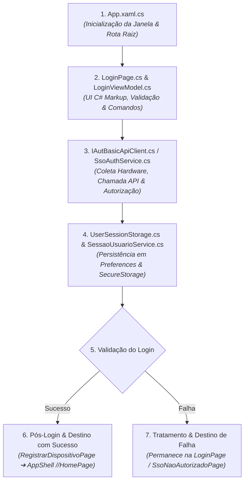
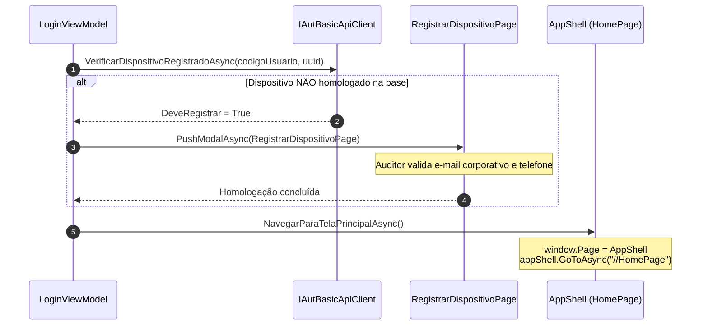

# 🧭 Roteiro de Estudos — Fluxo de Autenticação e Autorização de Login

> [!NOTE]
> Este guia estabelece a ordem cronológica recomendada para estudar os arquivos do módulo de login e autorização do **e-SEFAZ Mobile (App Auditor)**, cobrindo da inicialização da tela até os destinos de sucesso e tratamento de falhas.

---

## 🗺️ Mapa Visual do Fluxo



---

## 🚀 Ordem Cronológica de Estudo

### 1º Ponto de Partida: Inicialização do App
* **Arquivo:** `ESefaz.Mobile.Presentation/App.xaml.cs`
* **Por que estudar primeiro:**
  * Define qual tela é exibida quando o aplicativo sobe na memória.
  * No método `CreateWindow(IActivationState? activationState)` (linhas 66–85), você verá que a aplicação **sempre inicia na tela de login**, encapsulando-a em uma pilha de navegação:
    ```csharp
    var loginPage = _serviceProvider.GetRequiredService<LoginPage>();
    var window = new Window(new NavigationPage(loginPage));
    ```

---

### 2º A Tela de Login e a ViewModel
* **Arquivos:**
  1. `ESefaz.Mobile.Presentation/Pages/LoginPage.cs` (View em C# Markup)
  2. `ESefaz.Mobile.Presentation/ViewModels/LoginViewModel.cs` (ViewModel principal operacional)
* **O que analisar:**
  * **Em `LoginPage.cs`:**
    * A interface é desenhada puramente em código C# (sem XAML).
    * Observe as associações de binding de `Login` (CPF) e `Password` (Senha).
    * O evento `Appearing += OnPageAppearing` aciona o método `viewModel.OnAppearingAsync()`.
  * **Em `LoginViewModel.cs`:**
    * `ValidarFormulario()` (linha 462): validação prévia de preenchimento antes do disparo da requisição.
    * `[RelayCommand] LoginAsync()` (linha 348): orquestrador do login básico (CPF e senha).
    * `[RelayCommand] NavigateToSsoPageAsync()` (linha 539): acionador do fluxo de login SSO.

---

### 3º Autorização e Execução da Chamada (A Requisição)
Quando o usuário aciona o login, os seguintes componentes executam a autenticação e preparam a autorização futura:

* **Arquivos:**
  1. `ESefaz.Mobile.Infrastructure/Device/DeviceInfoService.cs` e Provedores Nativos (`AndroidDeviceIdentifierProvider.cs` / `IosDeviceIdentifierProvider.cs`):
     * Coletam o UUID exclusivo do hardware (`Settings.Secure.AndroidId` no Android e `IdentifierForVendor` no iOS), marca, modelo e versão do SO.
  2. `ESefaz.Mobile.Infrastructure/Api/AutBasic/IAutBasicApiClient.cs`:
     * Contrato Refit do endpoint `GET /v1/app-auditor/mobile/basic`.
     * No método `LoginViewModel.EfetuarLoginSenhaAsync()` (linha 473), analise como os dados do dispositivo e as credenciais são enviadas via cabeçalho `Authorization: Basic <base64(cpf:senha)>`.
  3. `ESefaz.Mobile.Presentation/Helpers/SsoAuthenticationService.cs` (Fluxo SSO):
     * Caso a opção seja SSO, este serviço gera os parâmetros PKCE (`code_verifier`, `code_challenge`), abre o navegador do sistema via `WebAuthenticator` e processa o retorno no esquema `appauditor://callback`.
  4. `ESefaz.Mobile.Infrastructure/Api/Handlers/RefitAuthorizationHandler.cs`:
     * **Peça-chave da autorização:** Interceptor HTTP (`DelegatingHandler`). Analise este arquivo para entender como, após a autenticação, **todas as requisições de negócio** recebem automaticamente o `Authorization: Bearer <token>`, o `client_id: b850e9e3` e os cabeçalhos contextuais `cnpj` e `ie` da empresa ativa selecionada pelo auditor.

---

### 4º Persistência dos Dados de Sessão
Após a validação positiva das credenciais (`AutBasicResponse` ou `SigninSsoResponse`), a sessão e os tokens precisam ser armazenados com segurança.

* **Arquivos:**
  1. `ESefaz.Mobile.Infrastructure/Storage/UserSessionStorage.cs`:
     * Método `SaveSessionAsync(userId, session)`: serializa e persiste o objeto unificado `UserSessionData` em `Preferences` sob a chave `Session_{userId}`.
     * Salva o **Refresh Token** de forma encriptada no `SecureStorage` sob a chave `RefreshToken_{userId}` quando o recurso de biometria está habilitado.
     * Registra o último usuário ativo através de `SetLastUserAsync`.
  2. `ESefaz.Mobile.Infrastructure/Services/SessaoUsuarioService.cs`:
     * Mantém os dados da sessão em memória durante a execução do app (`UsuarioSessao`, `TokenSessao`, `EmpresaSelecionadaSessao`).
     * Permite consultar a matrícula, nome e CPF do auditor e gerencia o histórico de empresas vinculadas/selecionadas.

---

### 5º Onde o Aplicativo Verifica se o Usuário Já Tem Login?
A verificação de existência e validade de uma sessão anterior ocorre em pontos estratégicos:

* **Arquivos:**
  1. `ESefaz.Mobile.Presentation/ViewModels/LoginViewModel.cs`:
     * `ExecutarReloginBiometricoAsync(string userId, bool silentFailure)` (linha 1567): verifica se há uma sessão persistida para o `userId`.
     * `TokenPreferenciasAusenteOuExpirado()` (linha 307) e `TokenJwtExpirado(string jwt)` (linha 240): inspecionam o claim de expiração `exp` do JWT. Se o token ainda for válido ou se for possível usar o Refresh Token, a sessão é restabelecida diretamente.
  2. `ESefaz.Mobile.Infrastructure/Storage/UserSessionStorage.cs`:
     * Métodos `GetLastUserIdAsync()` e `GetSessionAsync(userId)`: fornecem o estado de sessões anteriores salvas no dispositivo.
  3. `ESefaz.Mobile.Infrastructure/Auth/AuthenticationService.cs` (Arquitetura Refatorada):
     * Método `IsAuthenticatedAsync()` (linha 109): consulta o último `userId` e verifica se `DateTimeOffset.UtcNow.ToUnixTimeSeconds() < session.ExpiresAt`.

---

### 6º Para Onde o Usuário Vai Quando o Login Tem Sucesso?

O fluxo com sucesso inclui uma etapa intermediária de conformidade antes de abrir a Home:



1. **Etapa Intermediária — Homologação de Dispositivo:**
   * Método: `LoginViewModel.VerificarRegistroDispositivoAsync()` (linha 1001).
   * Se o aparelho ainda não estiver homologado na SEFAZ, o app abre a modal `RegistrarDispositivoPage.xaml` (controlada por `DeviceRegistrationViewModel.cs`) solicitando confirmação de e-mail e telefone.
2. **Destino Final — Tela Principal:**
   * Método: `LoginViewModel.NavegarParaTelaPrincipalAsync()` (linha 1297).
   * Arquivos envolvidos: `ESefaz.Mobile.Presentation/AppShell.xaml.cs` e `HomePage.cs`.
   * A janela principal (`window.Page`) é substituída pela instância de `AppShell`:

     ```csharp
     var appShell = _serviceProvider.GetRequiredService<AppShell>();
     appShell.EnsureMainMenu(); // Monta dinamicamente a árvore de menus e abas
     window.Page = appShell;
     await appShell.GoToAsync("//HomePage", true);
     ```

---

### 7º Para Onde o Usuário Vai Quando o Login NÃO Tem Sucesso?

O comportamento do app varia conforme o tipo da falha:

1. **Credenciais Inválidas (Senha errada / CPF não localizado / Falha de Conexão):**
   * **Destino:** **Permanece na própria `LoginPage.cs`**.
   * **Método:** `LoginViewModel.ExibirErroLoginAsync(Exception ex)` (linha 1454).
   * O ViewModel trata a exceção (`ApiException`, `TaskCanceledException`), extrai uma mensagem amigável e exibe um alerta modal via `_userMessageService.ShowErrorAsync()`. O estado `IsBusy` é desativado e os campos ficam liberados para nova tentativa.
2. **Auditor Sem Permissão no SSO (HTTP 403 Forbidden):**
   * **Destino:** `ESefaz.Mobile.Presentation/Pages/SsoNaoAutorizadoPage.cs` (ou `SemPermissaoPage.cs`).
   * Ocorre quando a autenticação no portal do SSO foi bem-sucedida, mas o usuário não possui o perfil exigido para acessar o App Auditor.
3. **Falha Crítica de Homologação ou Sessão Inválida:**
   * **Destino:** Redirecionamento forçado para a `LoginPage.cs`.
   * O método `RetornarParaTelaLoginAsync()` (linha 1332) executa `SessionCleanupHelper.ClearAllAsync()`, limpa dados residuais de preferências/segredos e recria a `LoginPage` limpa como raiz da janela.

---

## 📋 Resumo da Sequência de Arquivos para Estudo

| Ordem | Arquivo | O que focar |
|:---:|---|---|
| **1º** | `Presentation/App.xaml.cs` | Inicialização da janela com `LoginPage` no método `CreateWindow()`. |
| **2º** | `Presentation/Pages/LoginPage.cs` | Interface em C# Markup, captura de entradas e ciclo de vida `Appearing`. |
| **3º** | `Presentation/ViewModels/LoginViewModel.cs` | Comandos `LoginAsync`, validação prévia e manipulação do fluxo de telas. |
| **4º** | `Infrastructure/Api/AutBasic/IAutBasicApiClient.cs` | Definição Refit do endpoint de login básico e envio de headers de hardware. |
| **5º** | `Infrastructure/Storage/UserSessionStorage.cs` | Métodos `SaveSessionAsync`, `GetSessionAsync` e uso do `SecureStorage`. |
| **6º** | `Infrastructure/Services/SessaoUsuarioService.cs` | Gestão em memória do usuário autenticado e da empresa ativa selecionada. |
| **7º** | `Infrastructure/Api/Handlers/RefitAuthorizationHandler.cs` | Como o Bearer Token, `client_id`, `cnpj` e `ie` são injetados nas APIs. |
| **8º** | `Presentation/Pages/RegistrarDispositivoPage.xaml` | Tela modal de homologação de conformidade do dispositivo físico. |
| **9º** | `Presentation/AppShell.xaml.cs` e `Pages/HomePage.cs` | Inicialização do menu pós-sucesso (`EnsureMainMenu`) e navegação para `//HomePage`. |
| **10º** | `Infrastructure/Helpers/SessionCleanupHelper.cs` | Rotina de expurgo total de tokens e preferências em caso de erro crítico ou logout. |
